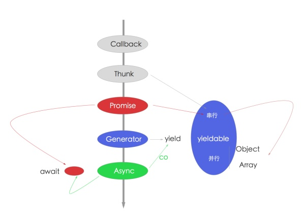

### 1. js语言的未来
typescript、babel（es）

### 2. js学习
这些书籍看多少遍都不为过
《js权威指南》 犀牛书
《js高级编程》
基于原型的写法，纵观JavaScript高级编程，就是翻来覆去的讲这个，这个很基础，但不好是很好用。可以不用，但不可以不会。

从面向过程走过来的同学，推荐这种写法，简单易用。但要注意面向对象要有面向对象的写法，要理解抽象，继承，封装，多态4个基本特征。如果想用好，你甚至还需要看一些设计模式相关的书。好在有《JavaScript设计模式》一书。

### 3. nodejs相关介绍
Node.js 是基于 Chrome V8引擎构建的，由事件循环（Event Loop）分发 I/O 任务，最终工作线程（Work Thread）将任务丢到线程池（Thread Pool）里去执行，而事件循环只要等待执行结果就可以了。

- Chrome V8 是 JavaScript 引擎
- Node.js 内置 Chrome V8 引擎，所以它使用的 JavaScript 语法
- JavaScript 语言的一大特点就是单线程，也就是说，同一个时间只能做一件事
- 单线程就意味着，所有任务需要排队，前一个任务结束，才会执行后一个任务。如果前一个任务耗时很长，后一个任务就不得不一直等着。
- 如果排队是因为计算量大，CPU 忙不过来，倒也算了，但是很多时候 CPU 是闲着的，因为 I/O 很慢，不得不等着结果出来，再往下执行
- CPU 完全可以不管 I/O 设备，挂起处于等待中的任务，先运行排在后面的任务
- 将等待中的 I/O 任务放到 Event Loop 里
- 由 Event Loop 将 I/O 任务放到线程池里
- 只要有资源，就尽力执行

Node.js 其实就是帮我们构建类似的机制。我们在写代码的时候，实际上就是取号的过程，由 Event Loop 来接受处理，而真正执行操作的是具体的线程池里的 I/O 任务。之所以说 Node.js 是单线程，就是因为在接受任务的时候是单线程的，它无需进程/线程切换上下文的成本，非常高效，但它在执行具体任务的时候是多线程的。


### 4. 安装node环境
- nvm（node version manager）【需要使用npm安装，替代品是yrm（支持yarn）】
- nrm（node registry manager）【需要使用npm安装，替代品是yrm（支持yarn）】
- npm（node packages manager）【内置，替代品是n或nvs（对win也支持）】

node版本发布非常快，而且多版本共存可能性较大，推荐使用nvm来安装node

```shell
$ curl -o- https://raw.githubusercontent.com/creationix/nvm/v0.33.6/install.sh | bash

$ echo 'export NVM_DIR="$HOME/.nvm"' >> ~/.zshrc
$ echo '[ -s "$NVM_DIR/nvm.sh" ] && . "$NVM_DIR/nvm.sh" # This loads nvm' >> ~/.zshrc
$ source ~/.zshrc

$ nvm install 0.10
$ nvm install 4
$ nvm install 6
$ nvm install 8
```
#### nrm

https://registry.npmjs.com 是node官方的源（registry），服务器在国外，下载速度较慢，推荐安装nrm来切换源，国内的cnpm和taobao的源都非常快，当然，如果你想自建源也是支持的。

```shell
$ npm install --global nrm --registry=https://registry.npm.taobao.org
$ nrm use cnpm
```

### 5. 工具使用
#### 常用软件

- 1）oh my zsh是我最习惯的shell，终端下非常好用

配合iterm2分屏 + spectacle全屏，几乎无敌

- 2）brew是mac装软件非常好的方式，和apt-get、rpm等都非常类似

安装4个必备软件

- brew install git 最流行的SCM源码版本控制软件
- brew install wget 下载、扒站神器
- brew install ack  搜索代码神器
- brew install autojump 终端下多目录跳转神器

- 3）vim

我虽然不算vim党，但也深爱着。janus是一个非常好用的vim集成开发环境。比如ctrl-p、nerdtree等插件都集成了，对我这种懒人足够了。

### 6. node的使用场景
- 1）跨平台：覆盖你能想到的面向用户的所有平台，传统的PC Web端，以及PC客户端 `nw.js/electron` 、移动端 `cordova`、HTML5、`react-native`、`weex`，硬件 `ruff.io` 等
- 2）Web应用开发：网站、Api、RPC服务等
- 3）前端：三大框架 React \ `Vue` \ `Angular` 辅助开发，以及工程化演进过程（使用`Gulp` /Webpack 构建 Web 开发工具）
- 4）工具：`npm`上各种工具模块，包括各种前端预编译、构建工具 `Grunt` / `Gulp`、脚手架，命令行工具，各种奇技淫巧等

1) 初衷，server端，不想成了前端开发的基础设施
2) 命令行辅助工具，甚至可以是运维
3) 移动端：cordova，pc端：nw.js和electron
4) 组件化，构建，代理
5) 架构，前后端分离、api proxy
6) 性能优化、反爬虫与爬虫
7) 全栈最便捷之路

### 7. nodejs 异步
- 异步流程控制学习重点
- Api写法：Error-first Callback 和 EventEmitter
- 流砥柱：Promise 
- 终极解决方案：Async/Await



#### Error-first Callback
回调函数的第一个参数返回的error对象，如果error发生了，它会作为第一个err参数返回，如果没有，一般做法是返回null。  
回调函数的第二个参数返回的是任何成功响应的结果数据。如果结果正常，没有error发生，err会被设置为null，并在第二个参数就出返回成功结果数据。  
```js
function(err, res) {  
  // process the error and result
}
```
#### EventEmitter  
事件模块是 Node.js 内置的对观察者模式“发布/订阅”（publish/subscribe）的实现，通过`EventEmitter`属性，提供了一个构造函数。该构造函数的实例具有 `on` 方法，可以用来监听指定事件，并触发回调函数。任意对象都可以发布指定事件，被 `EventEmitter` 实例的 `on` 方法监听到。

在node 6之后，可以直接使用`require('events')`类

```js
var EventEmitter = require('events')
var util = require('util')

var MyEmitter = function () {

}

util.inherits(MyEmitter, EventEmitter)

const myEmitter = new MyEmitter();

myEmitter.on('event', (a, b) => {
  console.log(a, b, this);
    // Prints: a b {}
});

myEmitter.emit('event', 'a', 'b');
```
#### Promise

```js
var promise = new Promise(function(resolve, reject) {
  // do a thing, possibly async, then…

  if (/* everything turned out fine */) {
    resolve("Stuff worked!");
  }
  else {
    reject(Error("It broke"));
  }
});

promise.then(function(text){
    console.log(text)// Stuff worked!
    return Promise.reject(new Error('我是故意的'))
}).catch(function(err){
    console.log(err)
});
```

#### Bluebird库  
Bluebird是 Node.js 世界里性能最好的Promise/a+规范的实现模块，Api非常齐全，功能强大，是原生Promise外的不二选择。

好处如下：

- 避免Node.js内置Promise实现 问题，使用与所有版本兼容
- 避免Node.js 4曾经出现的内存泄露问题
- 内置更多扩展，timeout、 promisifyAll等，对Promise/A+规范提供了强有力的补充  

#### Promise相关资料
- Node.js最新技术栈之Promise篇  https://cnodejs.org/topic/560dbc826a1ed28204a1e7de
- 理解 Promise 的工作原理 https://cnodejs.org/topic/569c8226adf526da2aeb23fd
- Promise 迷你书 http://liubin.github.io/promises-book/

#### Async/Await  
Async/Await是异步操作的终极解决方案，Koa 2在node 7.6发布之后，立马发布了正式版本，并且推荐使用async函数来编写Koa中间件。  
``` js
exports.list = async (ctx, next) => {
  try {
    let students = await Student.getAllAsync();
  
    await ctx.render('students/index', {
      students : students
    })
  } catch (err) {
    return ctx.api_error(err);
  }
};
```  
它做了3件事儿

- 通过await Student.getAllAsync();来获取所有的students信息。
- 通过await ctx.render渲染页面
- 由于是同步代码，使用try/catch做的异常处理

是不是非常简单，现在Eggjs里也都是这样同步的代码。  

Async函数要点如下：

- Async函数语义上非常好
- Async不需要执行器，它本身具备执行能力，不像Generator需要co模块
- Async函数的异常处理采用try/catch和Promise的错误处理，非常强大
- Await接Promise，Promise自身就足够应对所有流程了，包括async函数没有纯并行处理机制，也可以采用Promise里的all和race来补齐
- Await释放Promise的组合能力，外加co和Promise的then，几乎没有不支持的场景

综上所述

- Async函数是趋势，如果Chrome 52. v8 5.1已经支持Async函数(https://github.com/nodejs/CTC/issues/7)了，Node.js支持还会远么？
- Async和Generator函数里都支持promise，所以promise是必须会的。
- Generator和yield异常强大，不过不会成为主流，所以学会基本用法和promise就好了，没必要所有的都必须会。
- co作为Generator执行器是不错的，它更好的是当做Promise 包装器，通过Generator支持yieldable，最后返回Promise，是不是有点无耻？
- Generator是迭代器，主要用于运算，不太适合用作流程控制。

8. nodejs的业务能力
一般，后端开发指的是 Web 应用开发中和视图渲染无关的部分，主要是和数据库交互为主的重业务型逻辑处理。但现在架构升级后，Node.js 承担了前后端分离重任之后，有了更多玩法。从带视图的**传统Web应用**和**面向Api接口应用**，到通过 RPC 调用封装对数据库的操作，到提供前端 Api 代理和网关，服务组装等，统称为**后端开发**，不再是以往只有和数据库打交道的部分才算后端。这样，就可以让前端工程师对开发过程可控，更好的进行调优和性能优化。

Web编程核心

- 异步流程控制（前面讲过了）
- 基本框架 Koa或Express，新手推荐Express，毕竟资料多，上手更容易。如果有一定经验，推荐Koa，其实这些都是为了了解Web编程原理，尤其是中间件机制理解。
- 数据库 mongodb或mysql都行，mongoose和Sequelize、bookshelf，TypeOrm等都非常不错。对于事务，不是Node.js的锅，是你选的数据库的问题。另外一些偏门，像node连sqlserver等估计还不成熟，我是不会这样用的。
- 模板引擎， ejs，jade，nunjucks。理解原理最好。尤其是extend，include等高级用法，理解布局，复用的好处。其实前后端思路都是一样的。

学习路线
- 玩转 npm、gulp 这样的前端工具类（此时还是前端）
- 使用 node 做前后端分离（此时还是前端）
- express、koa 这类框架
- jade、ejs 等模板引擎
- nginx
- 玩转【后端】异步流程处理（promise/es6的(generator|yield)/es7(async|await)）
- 玩转【后端】mongodb、mysql 对应的 Node 模块

标准：
1. 基本的Node.js几个特性，比如事件驱动、非阻塞I/O、Stream等
2. 异步流程控制相关，Promise是必问的
3. 掌握1种以上Web框架，比如Express、Koa、Thinkjs、Restfy、Hapi等，会问遇到过哪些问题、以及前端优化等常识
4. 数据库相关，尤其是SQL、缓存、Mongodb等
5. 对于常见Node.js模块、工具的使用，观察一个人是否爱学习、折腾
6. 是否熟悉linux，是否独立部署过服务器，有+分
7. js语法和es6、es7，延伸CoffeeScript、TypeScript等，看看你是否关注新技术，有+分
8. 对前端是否了解，有+分
9. 是否参与过或写过开源项目，技术博客、有+分

