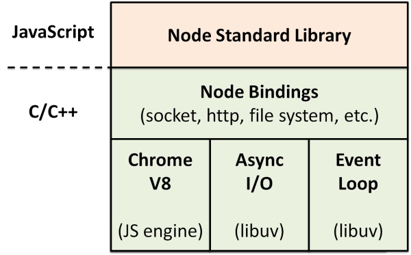
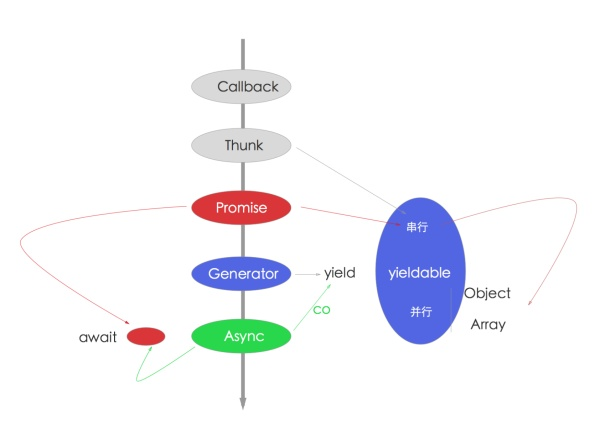

### 1. js语言的未来
typescript、babel（es）

### 2. js学习
这些书籍看多少遍都不为过
《js权威指南》 犀牛书
《js高级编程》
基于原型的写法，纵观JavaScript高级编程，就是翻来覆去的讲这个，这个很基础，但不好是很好用。可以不用，但不可以不会。

从面向过程走过来的同学，推荐这种写法，简单易用。但要注意面向对象要有面向对象的写法，要理解抽象，继承，封装，多态4个基本特征。如果想用好，你甚至还需要看一些设计模式相关的书。好在有《JavaScript设计模式》一书。

### 3. nodejs相关介绍
Node.js 是基于 Chrome V8引擎构建的，由事件循环（Event Loop）分发 I/O 任务，最终工作线程（Work Thread）将任务丢到线程池（Thread Pool）里去执行，而事件循环只要等待执行结果就可以了。

- Chrome V8 是 JavaScript 引擎
- Node.js 内置 Chrome V8 引擎，所以它使用的 JavaScript 语法
- JavaScript 语言的一大特点就是单线程，也就是说，同一个时间只能做一件事
- 单线程就意味着，所有任务需要排队，前一个任务结束，才会执行后一个任务。如果前一个任务耗时很长，后一个任务就不得不一直等着。
- 如果排队是因为计算量大，CPU 忙不过来，倒也算了，但是很多时候 CPU 是闲着的，因为 I/O 很慢，不得不等着结果出来，再往下执行
- CPU 完全可以不管 I/O 设备，挂起处于等待中的任务，先运行排在后面的任务
- 将等待中的 I/O 任务放到 Event Loop 里
- 由 Event Loop 将 I/O 任务放到线程池里
- 只要有资源，就尽力执行

Node.js 其实就是帮我们构建类似的机制。我们在写代码的时候，实际上就是取号的过程，由 Event Loop 来接受处理，而真正执行操作的是具体的线程池里的 I/O 任务。之所以说 Node.js 是单线程，就是因为在接受任务的时候是单线程的，它无需进程/线程切换上下文的成本，非常高效，但它在执行具体任务的时候是多线程的。



### 4. 安装node环境
- nvm（node version manager）【需要使用npm安装，替代品是yrm（支持yarn）】
- nrm（node registry manager）【需要使用npm安装，替代品是yrm（支持yarn）】
- npm（node packages manager）【内置，替代品是n或nvs（对win也支持）】

node版本发布非常快，而且多版本共存可能性较大，推荐使用nvm来安装node

```shell
$ curl -o- https://raw.githubusercontent.com/creationix/nvm/v0.33.6/install.sh | bash

$ echo 'export NVM_DIR="$HOME/.nvm"' >> ~/.zshrc
$ echo '[ -s "$NVM_DIR/nvm.sh" ] && . "$NVM_DIR/nvm.sh" # This loads nvm' >> ~/.zshrc
$ source ~/.zshrc

$ nvm install 0.10
$ nvm install 4
$ nvm install 6
$ nvm install 8
```
#### nrm

https://registry.npmjs.com 是node官方的源（registry），服务器在国外，下载速度较慢，推荐安装nrm来切换源，国内的cnpm和taobao的源都非常快，当然，如果你想自建源也是支持的。

```shell
$ npm install --global nrm --registry=https://registry.npm.taobao.org
$ nrm use cnpm
```

### 5. 工具使用
#### 常用软件

- 1）oh my zsh是我最习惯的shell，终端下非常好用

配合iterm2分屏 + spectacle全屏，几乎无敌

- 2）brew是mac装软件非常好的方式，和apt-get、rpm等都非常类似

安装4个必备软件

- brew install git 最流行的SCM源码版本控制软件
- brew install wget 下载、扒站神器
- brew install ack  搜索代码神器
- brew install autojump 终端下多目录跳转神器

- 3）vim

我虽然不算vim党，但也深爱着。janus是一个非常好用的vim集成开发环境。比如ctrl-p、nerdtree等插件都集成了，对我这种懒人足够了。

### 6. node的使用场景
- 1）跨平台：覆盖你能想到的面向用户的所有平台，传统的PC Web端，以及PC客户端 `nw.js/electron` 、移动端 `cordova`、HTML5、`react-native`、`weex`，硬件 `ruff.io` 等
- 2）Web应用开发：网站、Api、RPC服务等
- 3）前端：三大框架 React \ `Vue` \ `Angular` 辅助开发，以及工程化演进过程（使用`Gulp` /Webpack 构建 Web 开发工具）
- 4）工具：`npm`上各种工具模块，包括各种前端预编译、构建工具 `Grunt` / `Gulp`、脚手架，命令行工具，各种奇技淫巧等

1) 初衷，server端，不想成了前端开发的基础设施
2) 命令行辅助工具，甚至可以是运维
3) 移动端：cordova，pc端：nw.js和electron
4) 组件化，构建，代理
5) 架构，前后端分离、api proxy
6) 性能优化、反爬虫与爬虫
7) 全栈最便捷之路

### 7. nodejs 异步
- 异步流程控制学习重点
- Api写法：Error-first Callback 和 EventEmitter
- 流砥柱：Promise 
- 终极解决方案：Async/Await


